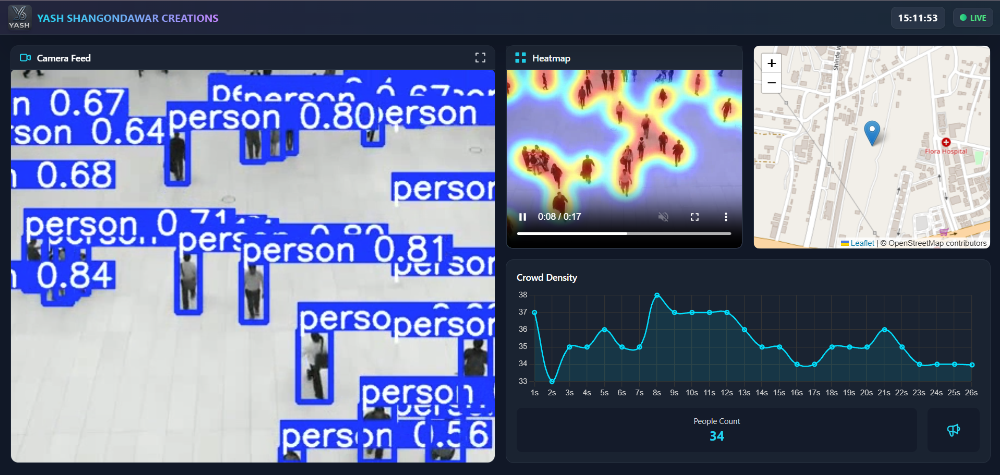
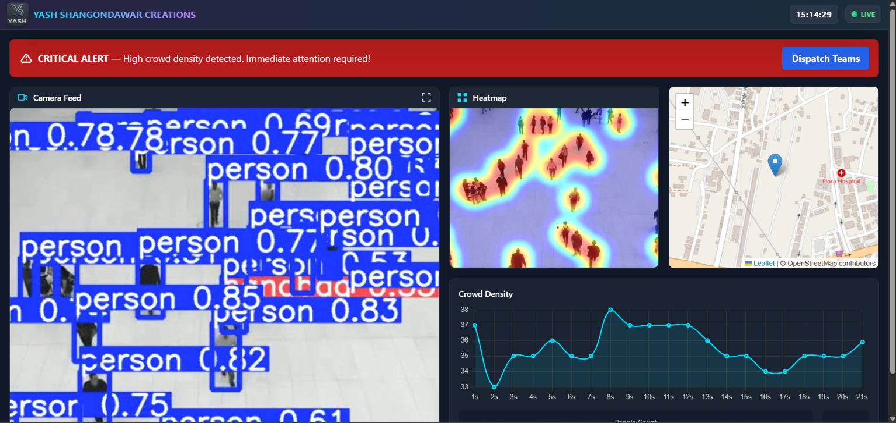

# 🖥️ Teerth-Rakshak — AI Crowd Monitoring Dashboard

> 🏆 Smart India Hackathon 2025 Winning Solution

## 🎯 Problem

Large-scale gatherings can experience sudden increases in crowd
density, making manual monitoring difficult and delaying the
identification of potentially dangerous overcrowding conditions.

## 💡 Solution

An AI-powered real-time monitoring dashboard that uses computer
vision to detect and count people, analyze crowd density, generate
heatmaps, and trigger alerts when crowd density crosses critical thresholds.

## 🛠️ Tech Stack

**Python • Flask • YOLOv8 • OpenCV • Matplotlib • HTML • JavaScript • Tailwind CSS • Leaflet**

## ✨ Key Features

- 👥 Real-Time Person Detection & Counting
- 🔥 Crowd-Density Heatmaps
- 📊 Crowd Density Analytics
- 🗺️ Location-Based Monitoring
- 🚨 Critical Crowd Alerts
- 🔔 Admin Response & Notifications

## 🖥️ Live Monitoring Dashboard

## 🚨 Critical Crowd Alert

---

## 🔗 Complete Project

For the complete Teerth-Rakshak solution, including the
Flutter-based pilgrim application and detailed system documentation:

[View Complete Teerth-Rakshak Showcase →](https://github.com/yash-shangondawar/Teerth-Rakshak-Showcase)
